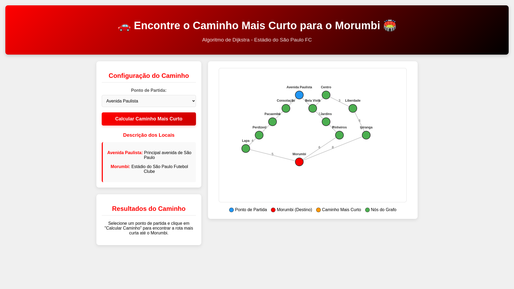
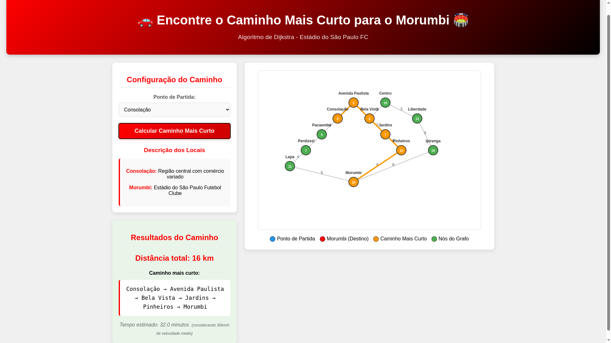

# Encontre o MorumBIS

**Conteúdo da Disciplina**: Grafos 2 
**Dupla**: 39

## Alunos

| Matrícula    | Aluno |
| -- | -- |
| 19/0083590    | Amanda Alves Campos |
| 21/1062900    | Caio Lucas Lelis Borges |

## Sobre

Aplicação web em React que encontra e visualiza o caminho mais curto até o Estádio do Morumbi em um grafo simplificado de bairros/regiões de São Paulo, utilizando o algoritmo de Dijkstra.

- Visualização interativa do grafo em canvas.
- Escolha do ponto de partida por dropdown ou clique no nó.
- Destaque do caminho mais curto e exibição da distância total e tempo estimado.
- Legenda visual e descrição dos locais.

Código principal:
- Algoritmo: [`dijkstra`](src/algorithms/dijkstra.js)
- Componentes: [`App`](src/App.js), [`GraphVisualization`](src/components/GraphVisualization.js), [`ControlsPanel`](src/components/ControlsPanel.js), [`ResultsPanel`](src/components/ResultsPanel.js)

## Screenshots
<h3 align="center">Tela inicial</h3>

  

<h3 align="center">Caminho calculado</h3>

  

## Instalação 
**Linguagem**: JavaScript 
**Framework**: React  

Pré-requisitos:
- Node.js LTS (18+ recomendado)
- npm (ou yarn)

Passos:
1. Instale dependências:
   - npm: `npm install`
   - yarn: `yarn`
2. Ambiente de desenvolvimento:
   - `npm start` ou `yarn start`
3. Build de produção:
   - `npm run build` ou `yarn build`

A aplicação sobe em http://localhost:3000.

## Uso

- Selecione o “Ponto de Partida” no painel à esquerda ou clique em um nó no grafo.
- Clique em “Calcular Caminho Mais Curto” para rodar Dijkstra até “Morumbi”.
- O caminho será destacado em laranja; distâncias aparecem dentro dos nós.
- O painel “Resultados do Caminho” mostrará a distância total e um tempo estimado.

Dicas:
- Passe o mouse/click próximo aos nós (raio ~15px) para selecioná-los.
- A legenda abaixo do canvas indica as cores de cada tipo de nó.

## Outros 

### Roadmap

- Exibir setas e suportar grafos direcionados.
- Permitir definir destino além do Morumbi.
- Suporte a múltiplos algoritmos (A*, BFS/DFS para comparação).
- Animação da execução do Dijkstra passo a passo.
- Validação/alertas quando não há caminho.

### Referências de código

- Algoritmo de Dijkstra: [`dijkstra`](src/algorithms/dijkstra.js)
- Componentes:
  - [`GraphVisualization`](src/components/GraphVisualization.js)
  - [`ControlsPanel`](src/components/ControlsPanel.js)
  - [`ResultsPanel`](src/components/ResultsPanel.js)
- App e integração: [`App`](src/App.js)
- Dados do grafo e posições:
  - [`graph`](src/data/graphData.js)
  - [`nodePositions`](src/data/graphData.js)
  - [`nodeDescriptions`](src/data/graphData.js)

### Estrutura do projeto (resumo)

- App raiz: [`App`](src/App.js)
- Algoritmo: [`dijkstra`](src/algorithms/dijkstra.js)
- Visual: [`GraphVisualization`](src/components/GraphVisualization.js)
- Controles: [`ControlsPanel`](src/components/ControlsPanel.js)
- Resultados: [`ResultsPanel`](src/components/ResultsPanel.js)
- Dados do grafo: [`graphData`](src/data/graphData.js)
- Estilos: [`App.css`](src/App.css), [`index.css`](src/index.css)